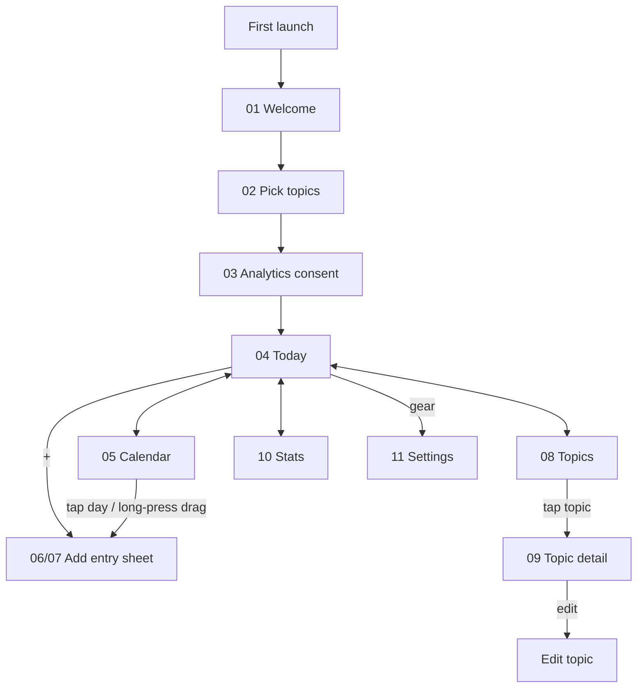

# User Flows — Habit Tracker v1.0

Screen numbers refer to `design/screens/index.html`.

## Navigation map

## F1 · Quick log (C2) — target 2 taps

| Step | Screen | User action | System response |
|---|---|---|---|
| 1 | 04 Today | Tap ＋ | Add sheet opens, date = today, status = Done |
| 2 | 06 Sheet | Tap "Gym" | Saves instantly (single-tap save when no note), sheet closes, toast "Gym logged · 20 in 3 months" |

## F2 · Date range (C3) — target 3 interactions

| Step | Screen | User action | System response |
|---|---|---|---|
| 1 | 05 Calendar | Long-press Oct 5, drag to Oct 7 | Range highlighted; sheet opens in **Date range** mode |
| 2 | 07 Sheet | Tap "Office" | Preview: "3 days · will be added as Planned" (future dates) |
| 3 | 07 Sheet | Tap "Add 3 days" | 3 entries saved with one `group_id`; faded dots appear |
| Alt | 04 → ＋ | Switch to Date range, pick From/To | Same result |
| Edge | — | Range includes a day already logged | "2 added, 1 already logged" |

## F3 · Plan, then tick (C4)

| Step | Screen | User action | System response |
|---|---|---|---|
| 1 | 05 Calendar | Tap Saturday → ＋ → "Friend's house" | Saved as Planned |
| 2 | 04 Today (Saturday) | Tap the empty check | Orbit-segment animation, haptic; moves to "Done today"; counts +1 |
| 3 | 04 Today (next day) | If still planned: "Did you go…?" prompt → Yes / No | Yes → Done on original date; No → user chooses delete or keep as planned |

## F4 · "When did I…?" (C6, C7, C8)

| Step | Screen | User action | System response |
|---|---|---|---|
| 1 | 08 Topics | Tap "Visited Mom" | 09 opens with last-used period |
| 2 | 09 Detail | Read the two cards | Count for period + "Last time · 23 days" — no scrolling |
| 3 | 09 Detail | Tap "Last 3 months" | Count, bars and list update < 300 ms |
| 4 | 09 Detail | Scroll | All dates newest first, grouped by month, with notes |

## F5 · Compare everything (C7, C8)

| Step | Screen | User action | System response |
|---|---|---|---|
| 1 | 10 Stats | Pick a period chip | Total card + ranked bars for every topic |
| 2 | 10 Stats | Custom → pick From/To | Range shown under the total |
| 3 | 10 Stats | Tap a topic row | Opens 09 with the same period |

## F6 · Back up and restore

| Step | Screen | User action | System response |
|---|---|---|---|
| 1 | 11 Settings | Export CSV / JSON | Android share sheet (Drive, email, Files) |
| 2 | New phone → 11 | Import backup → pick JSON | Validates, merges by id, shows "120 entries, 8 topics restored" |

## F7 · Change privacy choice

| Step | Screen | User action | System response |
|---|---|---|---|
| 1 | 11 Settings | Toggle "Anonymous usage stats" | Consent updated immediately; when off, no events are sent |
